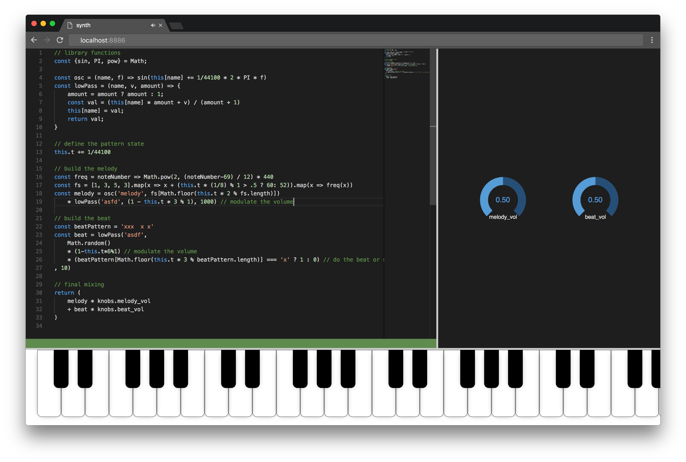

# muzikilo.js
A code driven synth for the browser

## What?
A tool for making music in the Browser with javascript.
Digital music is made of samples and samples are just numbers. Numbers can easily generated with javascript functions. So let's just run a js function you write for every sample (44100 times per second).

## Why?
1. "Man kann mit einem Computer Kunst und Schönheit schaffen."
[[1]](https://www.ccc.de/de/hackerethik) ("One can create art and beauty using computers.")
1. Computers are fast. Let's write some inefficient code ;)
1. Live coding is nice

## How?
Go to [anujen.github.io/muzikilo.js](https://anujen.github.io/muzikilo.js) and play.
To get started, you can look at some [examples](examples/) or consult the [wiki](https://github.com/anuejn/muzikilo.js/wiki)

## Contribute
You are very welcome to contribute to muzikilo.js. Add features, fix bugs, write documentation or share your compositions. Compositions and documentation should go to the [wiki](https://github.com/anuejn/muzikilo.js/wiki), for the rest, we recomend reading [the contribution guidelines](CONTRIBUTING.md)